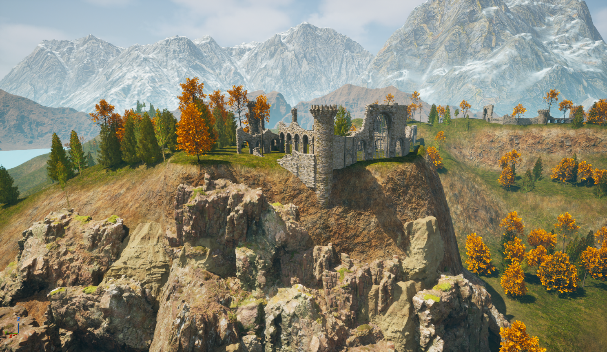

# Unreal Engine Environment Learning Project

This project was created as part of my learning journey in **Unreal Engine** to practice **environment creation**, focusing on scene composition, lighting, and asset placement.

## 🖼 Screenshots
 
 
 

## 🛠 Tools Used
- **Unreal Engine** (ofc)
- Megascans / Quixel Bridge for assets
- Starter Content for player controller
